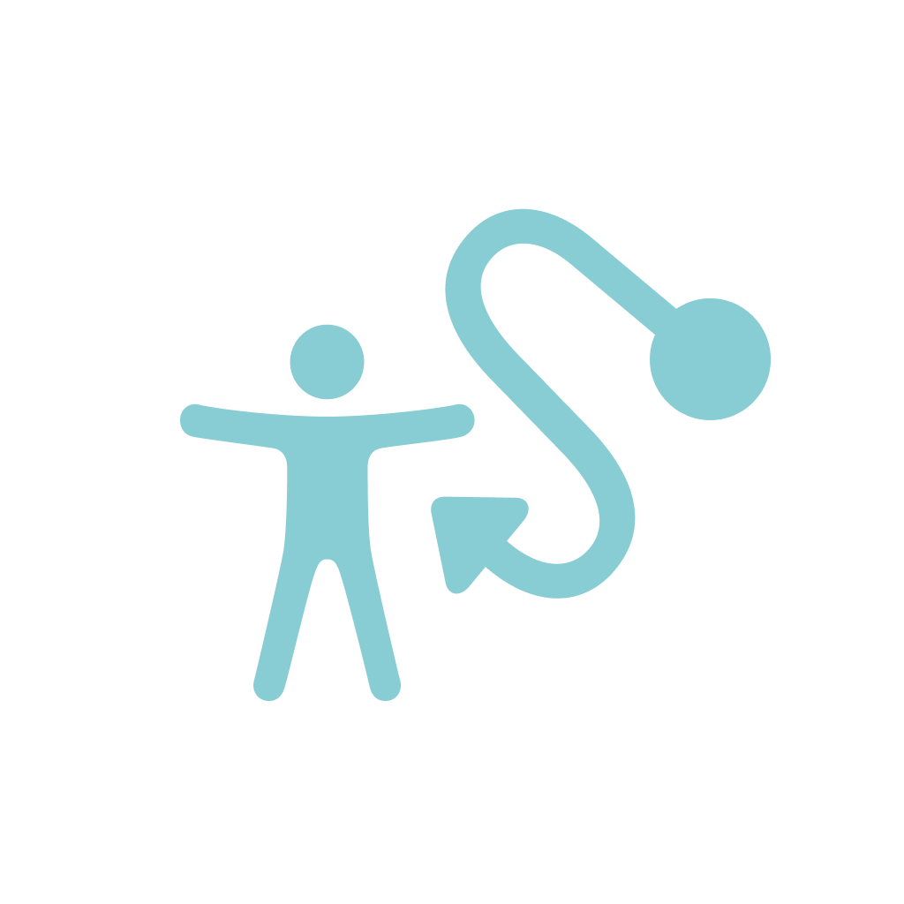

# Insight

<div align="center">
  
  
  ## Navigate Accessibly. Navigate Safely.
  
  **A SwiftUI iOS app empowering users with accessibility needs to navigate confidently**
  
  [](https://swift.org)
  [](https://www.apple.com/ios/)
  [](LICENSE)
  
  🏆 **Winner — Swift Changemakers Hackathon 2026 (Local Phase)**
  
</div>

---

## 🎯 About Insight

Insight is an accessibility-focused navigation application that helps users with mobility challenges navigate their environment safely. By combining real-time obstacle detection, accessibility profiling, and crowdsourced accessibility data, Insight creates personalized, safer routes for every user.

### The Problem
People with mobility challenges face daily obstacles: stairs, uneven terrain, narrow passages, and broken elevators. Current mapping apps don't account for these barriers, forcing users to rely on trial-and-error navigation or avoid unfamiliar areas.

### The Solution
Insight scans the environment in real-time, identifies accessibility barriers, and leverages crowdsourced accessibility data to recommend the safest, most accessible routes based on each user's specific needs.

---

## ✨ Key Features

### 🗺️ **Personalized Route Planning**
- **Multiple Accessibility Profiles**: Create custom profiles for different mobility needs (wheelchair users, visual impairment, motor limitations, etc.)
- **Adaptive Scoring**: Routes are penalized based on accessibility barriers relevant to the user's profile
- **Real-Time Evaluation**: Get instant feedback on route difficulty with accessible Spanish explanations

### 📱 **Real-Time Obstacle Detection**
- **Live Camera Scanning**: Detect stairs, obstacles, slopes, and accessibility barriers using device camera
- **AR Visualization**: Overlay detection results on the live camera feed
- **Confidence Scoring**: Know how confident the app is in each detection

### 🌍 **Crowdsourced Accessibility Data**
- **Heatmap Visualization**: See accessibility data contributions from other users in your area
- **Remote Tile System**: View obstacles detected and reported by the community
- **Contribute & Improve**: Add your own accessibility observations to help others

### 👤 **User Profiles & Authentication**
- **Phone-Based Auth**: Sign up and log in with phone number (no email required)
- **Avatar & Profile Management**: Upload custom avatars and edit profile information
- **Persistent Sessions**: Automatically remember authentication across app restarts

### 🎨 **Inclusive Design**
- **Dark Mode Support**: Full dark mode support for users with light sensitivity
- **Accessibility-First UI**: Built with VoiceOver and accessibility in mind
- **Spanish Localization**: Complete Spanish language support for barrier explanations
- **Privacy Manifest**: Apple Privacy Manifest included for transparency

### 📍 **Smart Location Services**
- **Background Location Tracking**: Continuous location access with proper permissions flow
- **Motion Detection**: Detect device motion for additional context
- **Geospatial Queries**: Nearby tile fetching using bounding box queries

---

## 🏗️ Architecture

### Tech Stack
- **Frontend**: SwiftUI + Combine
- **Backend**: Supabase (PostgreSQL + REST API + Storage)
- **Authentication**: Supabase GoTrue (phone + password)
- **Real-Time Detection**: Core Vision + ARKit
- **Location**: CoreLocation
- **Database**: Supabase PostgreSQL with RLS policies

### Core Components

#### **Views Layer**
```
InsightApp/Views/
├── Onboarding/          # Welcome, sign-up, login, permissions, personalization
├── Route/               # Route planning & evaluation display
├── Detecta/             # Real-time camera scanning interface
├── Map/                 # Heatmap visualization & nearby tiles
├── GhostLayer/          # AR overlay system
├── Services/            # Business logic & API integration
└── Profile/             # User profile management
```

#### **Models**
- `AccessibilityProfile`: User mobility profiles with penalty weights
- `AccessibilityTile`: Local accessibility barrier representation
- `RemoteTile`: Server-side tile model (Decodable)
- `AuthUser`: Authentication user data (Codable)

#### **Services**
- `AuthService`: GoTrue authentication, session management
- `TileAPIService`: REST API calls to Supabase (save & fetch tiles)
- `RouteEngine`: Route scoring algorithm with accessibility adjustments
- `AccessibilityScoringService`: Barrier penalty calculation
- `ProfileService`: ObservableObject for reactive profile switching
- `MotionAccessibilityService`: Device motion tracking
- `PersistenceService`: UserDefaults wrapper for local storage

#### **Storage**
- **Supabase Storage Buckets**:
  - `avatars/`: User profile photos
  - `scan-images/`: Accessibility barrier evidence photos

#### **Database Schema**
```sql
accessibility_tiles:
  - id (uuid, primary key)
  - user_id (uuid, fk to auth.users)
  - type (text) — stairs, obstacle, slope, limited
  - latitude, longitude (numeric)
  - confidence_score (numeric 0-1)
  - is_simulated (boolean)
  - created_at, updated_at (timestamp)

user_profiles:
  - id (uuid, primary key)
  - user_id (uuid, fk to auth.users, unique)
  - first_name, last_name, phone (text)
  - accessibility_profile_type (text)
  - avatar_url (text)
```

---

## 🚀 Getting Started

### Prerequisites
- macOS 12.0+
- Xcode 15.0+
- iOS 16.0+ deployment target
- CocoaPods (if using Supabase pod)

### Installation

1. **Clone the repository**
   ```bash
   git clone https://github.com/greciasaucedo/insight.git
   cd insight
   ```

2. **Configure Supabase Credentials**
   ```bash
   # Copy the example config
   cp InsightApp/Views/Services/SupabaseConfig.swift.example \
      InsightApp/Views/Services/SupabaseConfig.swift
   
   # Edit with your Supabase project credentials
   # Get these from: https://app.supabase.com/project/_/settings/api
   ```
   
   Update `SupabaseConfig.swift`:
   ```swift
   enum SupabaseConfig {
       static let projectURL = "https://YOUR_PROJECT_ID.supabase.co"
       static let anonKey = "YOUR_ANON_KEY"
   }
   ```
   
   ⚠️ **Important**: This file is git-ignored. Never commit credentials.

3. **Open in Xcode**
   ```bash
   open InsightApp.xcodeproj
   ```

4. **Set up Supabase Backend**
   
   Run these SQL migrations in your Supabase dashboard (SQL Editor):
   
   ```sql
   -- Enable RLS
   ALTER TABLE accessibility_tiles ENABLE ROW LEVEL SECURITY;
   ALTER TABLE user_profiles ENABLE ROW LEVEL SECURITY;

   -- Accessibility Tiles policies
   CREATE POLICY "Anyone can read tiles" ON accessibility_tiles
     FOR SELECT USING (true);
   
   CREATE POLICY "Authenticated users can insert tiles" ON accessibility_tiles
     FOR INSERT WITH CHECK (auth.uid() = user_id);
   
   CREATE POLICY "Users can update own tiles" ON accessibility_tiles
     FOR UPDATE USING (auth.uid() = user_id);

   -- User Profiles policies
   CREATE POLICY "Users can read own profile" ON user_profiles
     FOR SELECT USING (auth.uid() = user_id);
   
   CREATE POLICY "Users can insert own profile" ON user_profiles
     FOR INSERT WITH CHECK (auth.uid() = user_id);
   
   CREATE POLICY "Users can update own profile" ON user_profiles
     FOR UPDATE USING (auth.uid() = user_id);

   -- Extend schema
   ALTER TABLE user_profiles
     ADD COLUMN IF NOT EXISTS user_id uuid REFERENCES auth.users(id),
     ADD COLUMN IF NOT EXISTS first_name text,
     ADD COLUMN IF NOT EXISTS last_name text,
     ADD COLUMN IF NOT EXISTS phone text;

   ALTER TABLE accessibility_tiles
     ADD COLUMN IF NOT EXISTS user_id uuid REFERENCES auth.users(id);
   ```

5. **Create Storage Buckets**
   
   In Supabase Storage, create two public buckets:
   - `avatars` (5 MB limit, JPEG/PNG/WebP)
   - `scan-images` (50 MB limit, JPEG/PNG/WebP)

6. **Build & Run**
   ```bash
   # Select iPhone simulator or device
   # Press Cmd+R to build and run
   ```

---

## 📊 Project Structure

```
insight/
├── README.md                    # This file
├── CHECKLIST.md                # Development milestone tracker
├── .gitignore                  # Git ignore rules
├── InsightApp/
│   ├── InsightAppApp.swift      # App entry point
│   ├── ContentView.swift        # Root navigation logic
│   ├── ProfileView.swift        # User profile & settings
│   ├── ThemeManager.swift       # Dark/light mode management
│   ├── Assets/
│   │   └── Assets.xcassets/    # App icons, colors, images
│   ├── Models/
│   │   ├── AccessibilityProfile.swift
│   │   ├── AccessibilityTile.swift
│   │   ├── RemoteTile.swift
│   │   └── AuthUser.swift
│   └── Views/
│       ├── Onboarding/          # Auth & permissions flow
│       ├── Route/               # Route planning & evaluation
│       ├── Detecta/             # Camera scanning
│       ├── Map/                 # Heatmap display
│       ├── GhostLayer/          # AR overlay
│       └── Services/            # Business logic & APIs
├── InsightAppTests/            # Unit tests
└── InsightAppUITests/          # UI tests
```

---

## 🔐 Security & Privacy

### Credentials Management
- Supabase credentials are git-ignored in `SupabaseConfig.swift`
- **Never commit** credentials or API keys
- Use `.example` files as templates

### Data Protection
- Row-Level Security (RLS) policies enforce per-user data access
- Only authenticated users can create/modify tiles
- Users can only see their own profiles
- All storage access requires authentication tokens

### Privacy Compliance
- Apple Privacy Manifest (`PrivacyInfo.xcprivacy`) declares data usage
- Location, camera, and motion data collected only with explicit user consent
- Users can disable tracking at any time via iOS Settings

---

## 🛠️ Development Workflow

### Running Tests
```bash
# Unit tests
Cmd+U in Xcode

# UI tests
Product → Test in Xcode
```

### Development Checklist
See [CHECKLIST.md](CHECKLIST.md) for:
- Phase 1: Critical UI/UX fixes
- Phase 2: Accessibility profile system
- Phase 3: Supabase backend integration
- Phase 4: Authentication & profile backend

### Common Tasks

**Add a new accessibility barrier type:**
1. Update `AccessibilityProfile.penaltyWeights` in Models
2. Add case to tile type enum
3. Update scoring in `AccessibilityScoringService`
4. Add Spanish explanation message

**Modify route evaluation logic:**
1. Edit `RouteEngine.penaltyFor(tile:profile:)`
2. Update `AccessibilityScoringService.adjustedPenalty()`
3. Test with different accessibility profiles

---

## 📱 Supported Devices

- **iPhone**: 11 and later
- **iOS**: 16.0+
- **iPad**: Compatible (with modifications to UI layout)

---

## 🤝 Contributors

- **Grecia Saucedo** — Product design & frontend development
- **Guillermo Lira** — Backend & Supabase integration
- **Choche Sanchez** — Team coordination & full-stack development

---

## 🏆 Recognition

**Swift Changemakers Hackathon 2026 — Local Phase Winner**

Insight was recognized for its innovative approach to accessibility-first navigation, combining real-time computer vision, crowdsourced data, and inclusive design to create a product that genuinely improves lives.

---

## 📖 Resources

- [Supabase Documentation](https://supabase.com/docs)
- [SwiftUI Documentation](https://developer.apple.com/xcode/swiftui/)
- [iOS Accessibility Guide](https://www.apple.com/accessibility/)
- [Apple Privacy Manifest](https://developer.apple.com/documentation/bundleresources/privacy_manifest_files)

---

## 📄 License

This project is licensed under the MIT License — see LICENSE file for details.

---

## 💬 Get in Touch

Have questions or want to contribute? Reach out to the team:
- **GitHub**: [@greciasaucedo](https://github.com/greciasaucedo) | [@chochesanchez](https://github.com/chochesanchez)
- **Questions?** Open an issue on GitHub

---

<div align="center">
  <p><strong>Making navigation accessible for everyone.</strong></p>
  <p>Built with ❤️ for the Swift Changemakers community</p>
</div>
